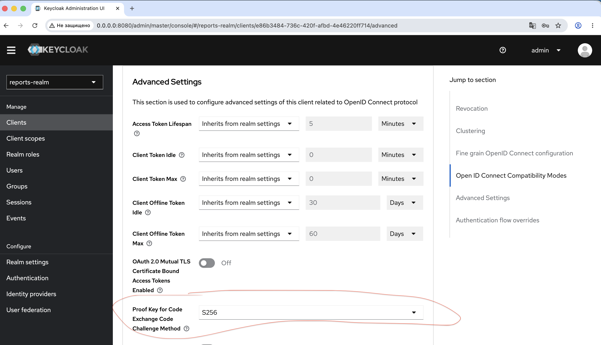

# Задание 1. Повышение безопасности системы

## Задача 1. Предложите архитектурное решение и доработайте диаграмму C4 для управления учётными данными пользователя.

Решение должно учитывать и обеспечивать следующие аспекты:
Унификацию доступа в системе BionicPRO. Это будет осуществляться через запрос данных учётных записей из внешнего источника, который расположен в стране представительства компании. Принципы локального хранения персональной и медицинской информации не должны быть нарушены.
Безопасную схему работы с access- и refresh-токенами, которая исключает передачу фронтенду токенов, которые были получены от IdP.
Возможность поддержки аутентификации пользователей через различные внешние удостоверяющие службы, действующие в разных странах.

### Текущие механизм авторизации:
Процесс аутентификации пользователя проходит через единую систему входа (SSO) с использованием Keycloak как провайдера аутентификации. Путь пользователя в целом выглядит так:

1) Переход на страницу: пользователь заходит на фронтенд-приложение.
2) Проверка аутентификации: если пользователь не авторизован, появляется кнопка «Логин».
3) Перенаправление на SSO: при нажатии на кнопку пользователь попадает на экран входа Keycloak. Этот сервис выполняет роль SSO, упрощая управление доступом для нескольких приложений.
4) Ввод данных: пользователь вводит свои учётные данные — логин и пароль — в Keycloak.
5) Возвращение на фронтенд: после успешного входа Keycloak перенаправляет пользователя обратно на фронтенд.
6) Получение токена: фронтенд использует временный код от Keycloak, чтобы запросить и получить токен для дальнейшей работы и доступов.

Авторизация реализовна по протоколу Oauth2.0, аутентификация -  OpenID connect c помощью JWT по Code Grant.

### Новое решение - использование Backend сервиса авторизации и своих токенов

Создается новый сервис - auth-service. Он занимается хранением и обновлением токенов, получаемых из Keycloak. Токены хранятся в Redis, пользователь получает сгенерированный uuid - по сути ключ сесии, к которому в redis привязаны access и refresh токены. 

Флоу авторизации:
1) клиент заходит на frontend
2) отправляется запрос на логин в auth-service. 
3) Auth-service определяет регион, откуда происходит логин и находит адрес нужного IdP (Keycloak).
4) auth-service формирует ссылку на авторизацию в Keycloak. генерит auth_id + state (для защиты от CSRF) + code_verifier, сохраняет все это в Redis по ключу auth_id с ttl 5 мин. хеш от code_verifier добавляется в redirect_uri вместе со state и auth_id. Клиенту возвращается redirect_uri, который смотрит на auth-service. 
5) Клиент получает HTTP 302 Found с redirec_uri в Location. Происходит переход в keycloak по полученной ссылке
6) Открывается окно логина, пользователь вводит свои данные, после чего keycloak делает redirect на auth-service
7) auth-service получает на вход Code Grant, проверяет state, запрашивает по нему из KeyCloak JWT с токенами, при этом передает в запрос code_verifier. Далее сохраняет токены (id,access,refresh), генерится sesssionID и возвращает на клиент.
8) Клиент сохраняет sessionID и выполняет последующие запросы с ним.
9) При запросе с sessionID auth-gateway (krakend) идет в кеш auth-service проверяет сессию. 
   1)  проверяет что она есть в кеше (не истек ttl)
   2)  получает jwt и отправляет его в запросе к нужному сервису. (сервисы сами валидируют JWT)

При logout вызывается auth-service вместе c токеном, после чего auth-service вызывает SSO logout у keycloak. (БТ на обнуление всех сессий не было)

## Задача 2. Улучшите безопасность существующего приложения, заменив Code Grant на PKCE. 

Добавлена секция attributes с pkce.code.challenge.method в [real-export.json](../keycloak/realm-export.json)

Также это можно сделать на вкладке advanced settings в Admin панели
