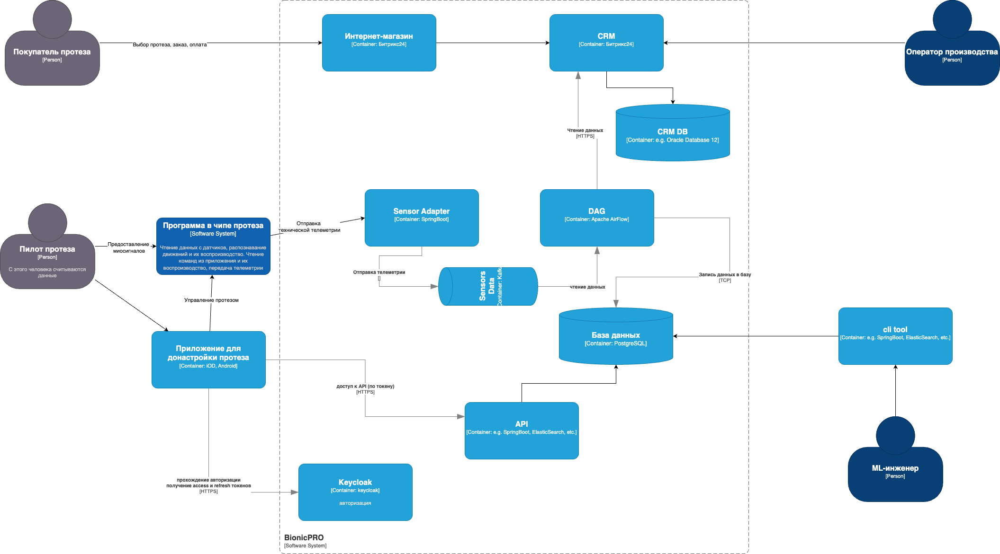
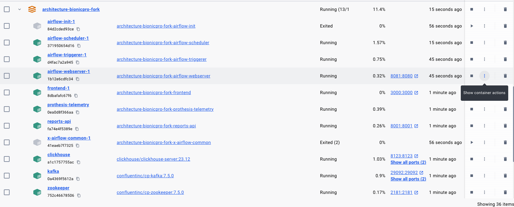
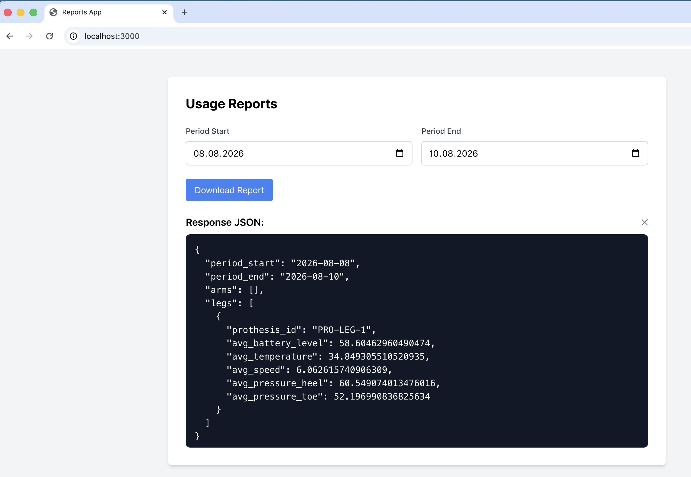
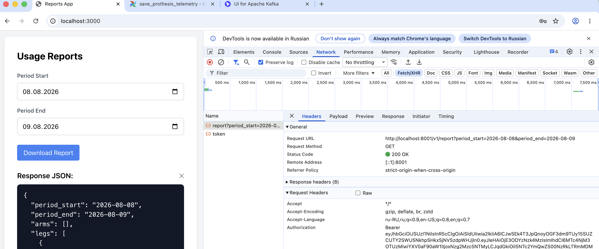
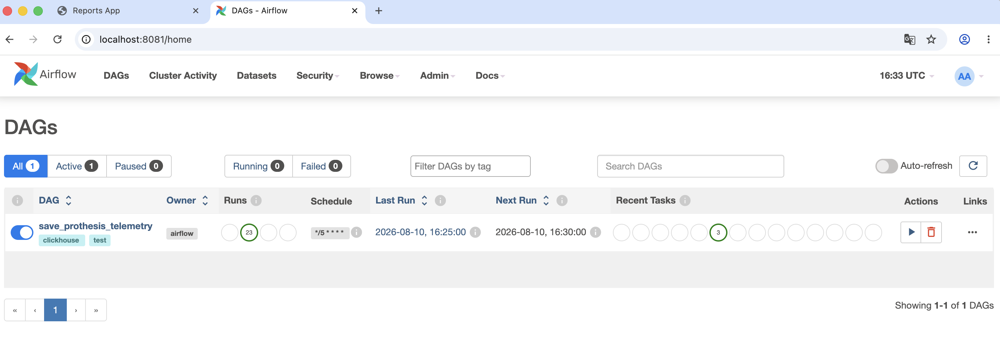
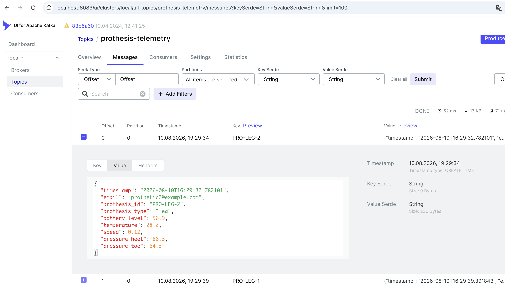

# Реализация ETL процесса + выгрузка отчета

## Диаграмма решения

В моей реализации вместо датчиков и sensor-adapter данные в кафку пишет специальный сервис

## Сервисы и контейнеры 

### Prothesis-Telemetry

[prothesis-telemetry](../prothesis-telemetry/src/main.py)

Сервис занимается эмуляцией данных с сенсора. Раз в период времени шлет данные в kafka топик prothesis-telemetry
Данные представляют из себя json с показаниями сенсоров протеза:
1) протеза руки

2) протеза ноги

**Данные содержат email владельца** по ним можно получить его идентификатор

### Clickhouse 

База данных для хранения данных телеметрии. В базе 2 таблицы: reports_db.prothesis_telemetry_leg и reports_db.prothesis_telemetry_arm

Схема таблиц в файле [init.sql](../clickhouse-init/init.sql)

### Airflow

Airflow используется для ETL обработки, контейнеры описаны в [docker-compose.yaml](../docker-compose.yaml)
Докер-файл находится в [Dockerfile](./docker/airflow/Dockerfile)

В Airflow реализован DAG для сбора телеметрии, код описан в [save_telemetry.py](dags/save_telemetry.py).

Алгоритм:
1) Запуск DAG раз в 5 минут
2) Чтение сообщений из топика prothesis-telemetry
3) Запрос user-id по email из базы keycloak из таблицы user_entity (Postgres).
4) Сохранение данных в табицах Clickhouse

### Reports API

Сервис для получения статистики из Clickhouse. 
Код находится в [папке](../reports-api)

Сервис выставляет API на GET localhost:8001/v1/reports?period_start=...&period_end=...

Метод защищен авторизацией - ожидает access_token в заголовке Authorization.

Алгоритм проверки:
1) полчить из заголовка access_token
2) декодировать payload с использованием публичного ключа keycloak (проверка подписи)
3) получить из payload.sub идентификатор пользователя
4) запросить из clickhouse средние показания за период по указанному пользователю

### Frontend

Доработан frontend сервис:
1) добавлен вызов сервиса reports-api
2) добавлены поля для ввода границ периода
3) добавлен вывод данных телеметрии

## Скриншоты

### список контейнеров

### frontend

### dags

### kafka-ui
